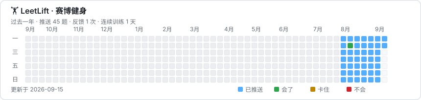

# LeetLift

> 赛博健身：每天早上随机推送一道算法题。再来一组 💪

LeetLift 使用 GitHub Actions 定时选题，默认可通过 Resend 邮件 API 发信，也支持 QQ 邮箱 SMTP 和 PushPlus。它支持 LeetCode Hot 100 和全题库，默认不重复；完成后可以在推送中选择“会了 / 卡住 / 不会”，GitHub 会自动维护复习队列。

[](https://github.com/wyh0626/LeetLift)

## 能做什么

- 每天北京时间 10:07 开始自动推送一道题，未成功时在 10 点时段重试
- `hot100` / `all` 两种题目范围
- 可按简单、中等、困难筛选，默认排除会员题
- 一轮内避免重复，全部练完后自动开始下一轮
- 推送包含题号、中英文标题、难度、知识点和 LeetCode 链接
- 通过预填 GitHub Issue 收集“会了 / 卡住 / 不会”反馈
- 到期复习题优先于新题，反馈 Issue 处理后自动关闭
- 自动生成过去一年的训练热力图，可嵌入 GitHub 个人首页
- 纯 Python 标准库，无服务器、无数据库、无第三方包

## 成本

个人使用基本是 0 元：

- 公开仓库使用标准 GitHub 托管 Runner 不计费；私有仓库受账户 Actions 配额限制
- Resend 免费额度足够每天一封；QQ SMTP 和 PushPlus 可作为备用
- 题目数据来自力扣网页使用的公开 GraphQL 接口

邮件服务和 GitHub Actions 配额可能调整，请以各自官网当前说明为准。

## 一次性启用

### 1. 配置邮件发送方式

#### 方案 A：Resend（推荐，配置最少）

使用收件邮箱注册 [Resend](https://resend.com/)，创建权限为 `Sending access` 的 API Key。没有自有域名时，Resend 的默认发件域名只能发给账号注册邮箱，正好适合个人自用。

创建两个 GitHub Secret：

| Name | Value |
| --- | --- |
| `RESEND_API_KEY` | `re_` 开头的 Sending access Key |
| `RESEND_TO` | Resend 账号注册邮箱 |

然后创建仓库变量 `DELIVERY_PROVIDER=resend`。`RESEND_TO` 本身不是接口凭据，但使用 Secret 可以避免收件地址出现在公开仓库中。

#### 方案 B：QQ 邮箱 SMTP 直发

建议注册一个只用于 LeetLift 的发件邮箱，避免授权码泄漏时影响主邮箱。进入发件 QQ 邮箱设置，开启 SMTP 服务并生成“授权码”；授权码不是 QQ 登录密码。

进入仓库：

`Settings → Secrets and variables → Actions → New repository secret`

创建三个 Secret：

| Name | Value |
| --- | --- |
| `SMTP_USERNAME` | 发件 QQ 邮箱，例如 `123456@qq.com` |
| `SMTP_PASSWORD` | QQ 邮箱生成的 SMTP 授权码 |
| `SMTP_TO` | 接收每日题目的邮箱 |

然后进入 `Actions → Variables`，创建仓库变量：

| Name | Value |
| --- | --- |
| `DELIVERY_PROVIDER` | `smtp` |

默认连接 `smtp.qq.com:465` 并强制使用 TLS。Secret 不要写入代码、配置文件、Issue 或 Actions 日志。

#### 方案 C：继续使用 PushPlus

1. 打开 [PushPlus](https://www.pushplus.plus/)，登录并关注其微信公众号。
2. 在个人中心复制你的用户 Token。
3. 在 `个人资料 → 邮箱` 中绑定并验证收件邮箱；邮件渠道不会读取仓库中的邮箱地址。
4. 不要把 Token 写进代码或 `config.json`。

创建 GitHub Secret：

| Name | Value |
| --- | --- |
| `PUSHPLUS_TOKEN` | 你的 PushPlus 用户 Token |

不创建 `DELIVERY_PROVIDER` 变量时，工作流读取 `config.json`。确认新通道测试成功后，可以删除旧通道的 Secret。

### 2. 允许工作流回写状态

进入：

`Settings → Actions → General → Workflow permissions`

选择 `Read and write permissions`。此外请确认仓库已启用 Issues；反馈按钮依赖 GitHub Issue。

如果默认分支启用了“禁止直接提交”的保护规则，需要允许 `github-actions[bot]` 写入，或者为此仓库调整对应规则。`state.json` 必须能被工作流提交，才能跨天去重和记录复习计划。

### 3. 首次测试

先进入 `Actions → Test LeetLift Delivery → Run workflow`，确认邮件通道测试成功；这不会选题、更新状态或修改热力图。

再进入 `Actions → Daily LeetLift → Run workflow`：

1. 先选择 `dry_run=true`，确认选题和 HTML 生成正常；这次不会推送。
2. 再选择 `dry_run=false`，确认已验证的邮箱收到消息。

定时工作流只会在默认分支上的 workflow 文件生效。

## 配置

编辑 [`config.json`](./config.json)：

```json
{
  "scope": "hot100",
  "difficulty": "all",
  "delivery_provider": "resend",
  "pushplus_channel": "mail",
  "resend_from": "LeetLift 赛博健身 <onboarding@resend.dev>",
  "smtp_host": "smtp.qq.com",
  "smtp_port": 465,
  "exclude_paid": true,
  "prefer_review": true,
  "timezone": "Asia/Shanghai",
  "max_history": 365
}
```

| 字段 | 可选值 | 说明 |
| --- | --- | --- |
| `scope` | `hot100` / `all` | 每日默认选题范围 |
| `difficulty` | `all` / `easy` / `medium` / `hard` | 难度筛选 |
| `delivery_provider` | `resend` / `smtp` / `pushplus` | 默认发送方式；可被仓库变量 `DELIVERY_PROVIDER` 覆盖 |
| `pushplus_channel` | `mail` / `wechat` / `app` / `clawbot` | PushPlus 发送渠道 |
| `resend_from` | 发件人 | 无自有域名时使用 `onboarding@resend.dev` |
| `smtp_host` | 域名 | SMTP 服务器，QQ 邮箱为 `smtp.qq.com` |
| `smtp_port` | 端口 | `465` 使用隐式 TLS，其他端口使用 STARTTLS |
| `exclude_paid` | `true` / `false` | 是否排除会员题 |
| `prefer_review` | `true` / `false` | 是否优先推送到期复习题 |
| `timezone` | IANA 时区名 | 反馈和历史记录使用的日期时区 |
| `max_history` | 大于等于 30 | `state.json` 最多保留多少条推送历史 |

手动运行工作流时，可以临时覆盖 `scope`，不会修改 `config.json`。

## 修改推送时间

默认配置位于 [`.github/workflows/scheduler.yml`](./.github/workflows/scheduler.yml)：

```yaml
on:
  schedule:
    - cron: "7,22,37,52 2 * * *"
```

GitHub cron 使用 UTC，上面的配置会在北京时间每天 10:07、10:22、10:37、10:52 尝试唤醒工作流。这里特意避开整点，因为 GitHub Actions 在整点负载较高，定时任务可能延迟，极端情况下会被丢弃。调度器与可手动运行的 `daily.yml` 分离；LeetLift 会检查当天是否已成功推送，四次调度、手动补发和迟到任务实际最多发送一封邮件。

常用时间：

| 北京时间 | UTC cron |
| --- | --- |
| 07:30 | `30 23 * * *` |
| 08:00 | `0 0 * * *` |
| 09:00 | `0 1 * * *` |
| 10 点时段四次兜底 | `7,22,37,52 2 * * *` |

修改 cron 后提交到默认分支即可。

## 反馈与复习机制

Resend、SMTP 邮件和 PushPlus 都是单向推送，因此这里采用零后端方案：

1. 在邮件或微信推送底部点击“会了 / 卡住 / 不会”。
2. 浏览器打开已经填好的 GitHub Issue。
3. 点击 `Submit new issue`。
4. `Record LeetLift Feedback` 工作流验证提交人是仓库 owner，更新 `state.json`，然后自动关闭 Issue。

复习间隔：

- 会了：逐步延长到 3、7、15、30、60、90 天
- 卡住：次日复习，并降低当前熟练等级
- 不会：次日复习，从第一级重新开始

这是两次点击方案，需要手机浏览器保持 GitHub 登录。如果以后需要真正的一键反馈，可以把链接替换为 Cloudflare Worker，但当前版本不需要部署任何后端。

## 本地运行

项目要求 Python 3.11+，没有依赖安装步骤。

```bash
python3 -m unittest discover -s tests -v
python3 -m leetlift daily --dry-run --repository wyh0626/LeetLift
```

真实推送：

```bash
PUSHPLUS_TOKEN="你的 token" python3 -m leetlift daily --repository wyh0626/LeetLift
```

使用 Resend：

```bash
DELIVERY_PROVIDER=resend \
RESEND_API_KEY="re_..." \
RESEND_TO="收件邮箱" \
python3 -m leetlift daily --repository wyh0626/LeetLift
```

使用 QQ SMTP：

```bash
DELIVERY_PROVIDER=smtp \
SMTP_USERNAME="发件邮箱" \
SMTP_PASSWORD="SMTP 授权码" \
SMTP_TO="收件邮箱" \
python3 -m leetlift daily --repository wyh0626/LeetLift
```

不要把包含真实 API Key、Token 或 SMTP 授权码的 shell 历史、日志或截图提交到仓库。

单独重新生成热力图：

```bash
python3 -m leetlift heatmap
```

热力图输出到 `assets/leetlift-heatmap.svg`。蓝色表示当天收到题目，绿色、黄色、红色分别表示“会了、卡住、不会”。每日推送和反馈工作流都会自动重新生成并提交它。

## 在 GitHub 个人首页展示

在与 GitHub 用户名同名的公开仓库 `wyh0626/wyh0626` 的根目录 `README.md` 中引用：

```html
<a href="https://github.com/wyh0626/LeetLift">
  
</a>
```

GitHub 会直接读取最新 SVG；更新后可能有短暂缓存。

## 项目结构

```text
.
├── .github/workflows/
│   ├── daily.yml       # 定时选题、推送、回写状态
│   ├── scheduler.yml   # 定时唤醒 daily 工作流
│   ├── delivery-test.yml # 单独测试发送通道，不修改状态
│   └── feedback.yml    # 处理反馈 Issue、更新复习队列
├── leetlift/           # Python 标准库实现
├── tests/              # 单元测试
├── assets/             # 自动生成的年度 SVG 热力图
├── config.json         # 用户配置
└── state.json          # 去重、历史和复习状态
```

## 稳定性说明

LeetCode 没有为这个场景提供承诺稳定的公开 API；本项目调用的是其网页当前使用的 GraphQL 接口。如果字段将来变化，工作流会明确失败且不更新 `state.json`，不会把一次失败误记成已经推送。

只有邮件服务返回成功后，LeetLift 才会保存当天状态。Resend 请求使用每日幂等键，重复执行不会重复发信。服务端接受邮件不等同于最终进入收件箱，收件方仍可能延迟、退信或归入垃圾箱。

## License

[MIT](./LICENSE)
